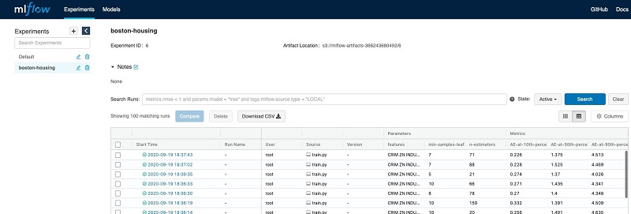
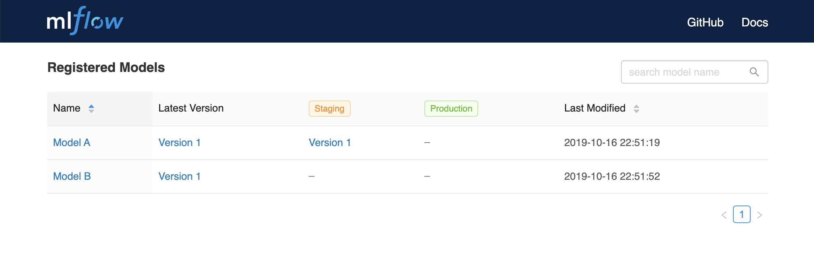
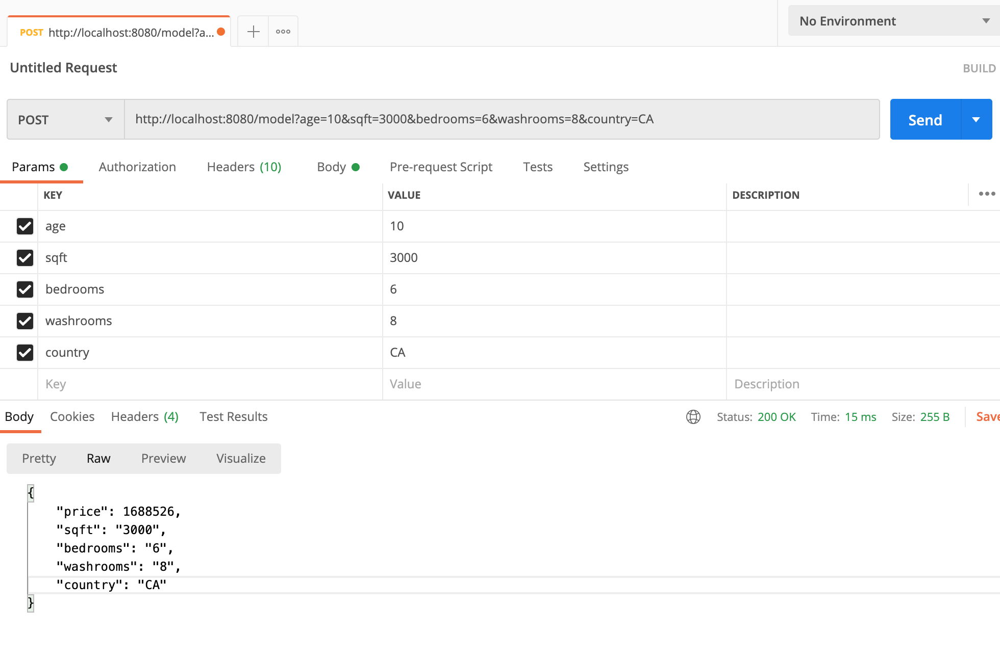

# ml-service

# About this Project
Example Machine Learning service. Machine learning models are versioned, trained and saved (via. mlflow) and Flask is used for serving the model over HTTP.

## Built With
* Python 3.9
* Docker
* mlflow
* Flask

## Components
* Registry: tracking server used for experiment tracking, metadata management, model versioning.
* Registry Backend: database backend which stores experiment metadata.
* Artifact Store: file storage for experiment artifacts (models, datasets, etc).
* Service: client interface to model.

# Usage
```
git clone <repo>
cd <repo>
docker-compose up --build
```

## mlflow
End-to-end platform for managing machine learning models. Credits to mlflow.

### Experiment Tracking
Component within mlflow which enables developers to manage metadata (training parameters, model hyperparameters), artifacts (models, datasets), outputs (performance) related to individual experiments.




### Model Registry
Component within mlflow which enables developers to version and store models across multiple environments (dev / stage / prod).



### Flask Web Service
Expose production model and metadata (via. HTTP).


